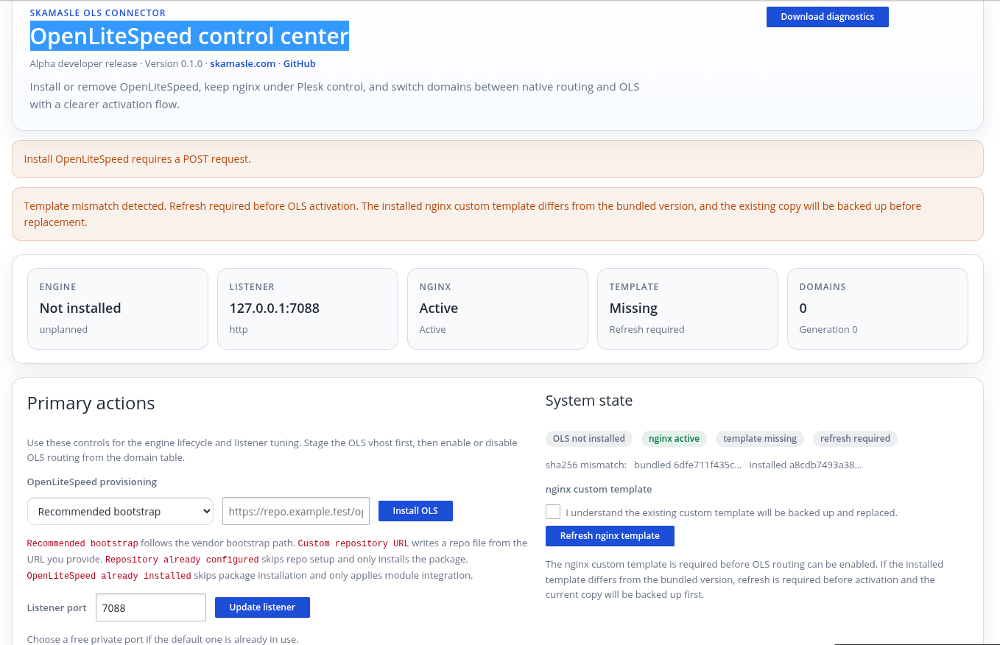
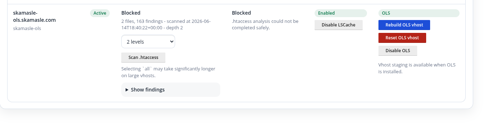
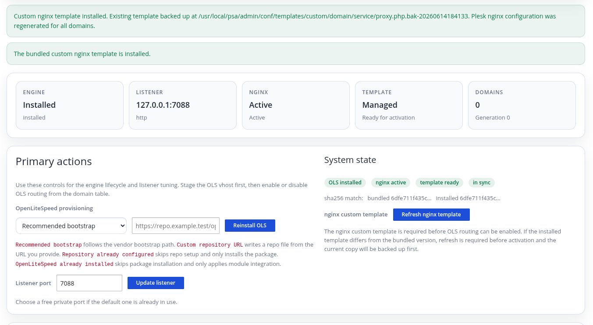
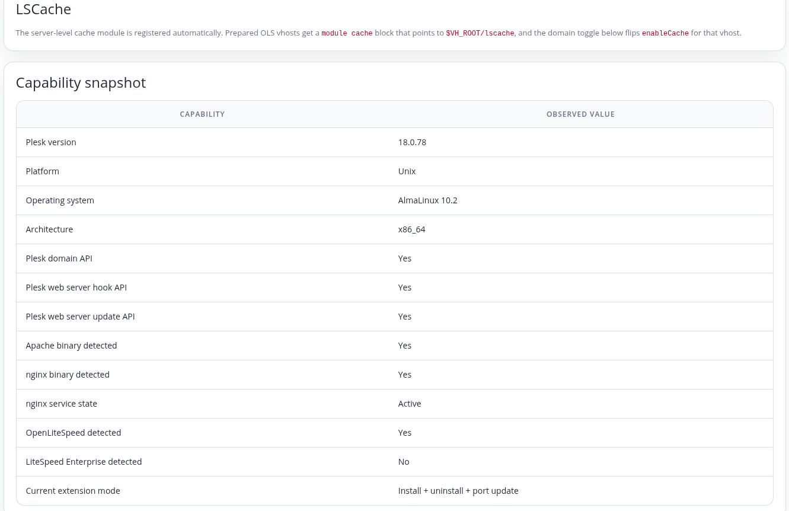

# Skamasle OpenLiteSpeed Module for Plesk

[Versión en español](LEEME.md)

## Warning

Do not install this module in production.

Plesk does not officially support OpenLiteSpeed:
https://support.plesk.com/hc/en-us/articles/12377585683095-Does-Plesk-support-OpenLiteSpeed-Web-Server-or-LiteSpeed-installed-manually

OpenLiteSpeed does not support every Apache rule that may appear in `.htaccess`:
https://docs.openlitespeed.org/config/rewriterules/

Again: do not install this module in production. The codebase was generated with AI after a human-authored project brief, and it should not be treated as production-ready until a human has reviewed 100% of the generated code. The current review status is below 7%.

Human testing may reduce the risk, but it does not make this safe. If you install it anyway, the risk is yours, not the module's. And if your plan is to use this as a substitute for a properly licensed LiteSpeed Enterprise deployment, that is exactly the wrong use case.

Development is being done on AlmaLinux 10.2 with the latest Plesk release available in the lab. More Plesk and OS versions still need to be tested before anyone should assume broad compatibility.

OpenLiteSpeed integration for Plesk as an optional per-domain web backend,
with support for installing the engine while still avoiding Apache replacement,
nginx removal, or modification of files managed by Plesk.

The project is currently split into two cooperating but independent systems:

- the Plesk extension in `extension/`;
- an optional future agent for `.htaccess` and Plesk event reconciliation.

The agent is not packaged in the extension ZIP yet. Both pieces can work
together, but neither one depends on the other to exist at install time.

Skamasle OLS is the product identity. Plesk is the first platform adapter;
future adapters may target other hosting panels while sharing the state model,
OLS renderer, compatibility scanner, and reconciliation engine.

The goal is not to trick Plesk into believing that Apache is still running.
Apache remains installed, active, and available to the domains that use it.
OpenLiteSpeed is added as a third execution path for domains that can benefit
from LSPHP/LSAPI.

## What Exists Today

This repository currently contains the Plesk extension and the supporting
scripts it needs to inspect the server and prepare OpenLiteSpeed. The current
state is intentionally conservative:

- it discovers the server capabilities and the installed PHP handlers;
- it shows a domain inventory and the current routing state;
- it validates whether a domain can move toward OLS;
- it installs OpenLiteSpeed without replacing Apache or nginx;
- it keeps the native Plesk routing as the default fallback;
- it stores the control-plane state needed for later activation work.

In practice, that means the extension is already useful as an inventory and
preparation tool, but it is not yet a full migration system. The UI is built
to surface what the platform can do now and what still needs operator review
before a domain is routed to OLS.

## Generate the Extension

Build the Plesk extension ZIP from the repository root with:

```bash
bash scripts/build-extension.sh
```

The script stages `extension/` into a fresh archive under `build/` and bumps
the release number automatically. The resulting file follows this pattern:

```text
build/skamasle-ols-plesk-<version>-<release>.zip
```

After building, validate the archive with:

```bash
bash tests/package.sh
```

That test checks the ZIP contents, confirms the module metadata, and makes
sure no development files leaked into the package.

## Screenshots

This is a good place to add annotated captures from Plesk once you have them.
Suggested images:

- the extension dashboard and capability summary;
- the domain inventory view;
- the domain readiness result for one compatible and one incompatible domain;
- the OpenLiteSpeed installation action and its status result;
- the native versus OLS routing state for a domain.

Example layout:







## The Idea

A Plesk installation already provides two native modes:

```text
nginx -> Apache -> PHP handler configured in Plesk
nginx -> Plesk PHP-FPM
```

This project preserves both and adds a third:

```text
nginx -> OpenLiteSpeed -> LSPHP/LSAPI
```

Routing is selected per domain. A single server can simultaneously host:

- domains served by Apache and their Plesk PHP handler;
- nginx-only domains served by PHP-FPM;
- domains routed to OpenLiteSpeed and executed through LSPHP/LSAPI.

The server is not migrated globally. OpenLiteSpeed is used only for domains
whose performance requirements justify LSAPI and whose configuration is
compatible.

Not every domain can run safely on OpenLiteSpeed. Its `.htaccess` support is
not equivalent to Apache's: compatibility primarily covers `mod_rewrite`
rules, while other Apache directives may be unsupported or ignored. Domains
that depend on such directives remain on their native Plesk mode.

## Why Apache Is Not Replaced

Plesk manages Apache as part of its web stack. It expects its binaries, systemd
units, modules, and configuration in specific locations. Plesk also validates
and regenerates them during operations such as:

- `plesk repair web`;
- Plesk and operating system updates;
- hosting and PHP version changes;
- domain creation, suspension, and removal;
- certificate renewal;
- WordPress Toolkit operations.

Moving Apache binaries, replacing its service, or installing wrappers that
simulate Apache responses creates a fragile dependency on Plesk internals and
the operating system package manager.

This project follows one fundamental rule:

> Apache remains intact and fully functional.

Therefore:

- `/usr/sbin/httpd` and `/usr/sbin/apache2` are not renamed;
- `httpd.service` and `apache2.service` are not replaced or masked;
- the extension never returns a fake `Syntax OK`;
- Plesk-generated configuration is not edited directly;
- `plesk repair web` can continue validating and rebuilding the native stack.

If OpenLiteSpeed becomes unavailable or an update is incompatible, each
affected domain returns to its native Plesk mode.

## Why nginx Remains the Orchestrator

Plesk already uses nginx as its frontend and generates per-domain
configuration for it. Keeping nginx on public ports `80` and `443` preserves:

- TLS termination;
- certificates and ACME renewals;
- Plesk-managed IP addresses and bindings;
- Plesk-generated redirects and headers;
- WordPress Toolkit integration;
- normal panel logging and operations;
- regeneration through official Plesk tools.

OpenLiteSpeed does not listen directly on `80` or `443`. It runs as a backend
on a private loopback listener:

```text
Internet
   |
   v
Plesk-managed nginx :80/:443
   |
   +--> Apache + Plesk PHP
   |
   +--> Plesk PHP-FPM
   |
   `--> OpenLiteSpeed on loopback --> LSPHP/LSAPI
```

nginx selects the backend for each domain from the configuration generated by
Plesk and the routing requested through the extension.

This limits the integration impact: nginx remains the real frontend and Apache
remains a real service from Plesk's perspective. The extension changes the
upstream only for domains explicitly enabled for OLS, using supported extension
points.

## Why OLS Is Used Only With LSAPI/LSPHP

OpenLiteSpeed alone does not provide enough benefit if PHP continues to run
through PHP-FPM. Plesk already provides nginx-only with PHP-FPM, so adding
another web server in that path would mostly add complexity.

This project therefore does not implement `OLS + PHP-FPM`.

An OLS domain uses:

- its own LSPHP external application;
- an exclusive LSAPI socket;
- the domain system user and group;
- PHP SuEXEC ProcessGroup;
- Detached Mode;
- process, memory, and timeout limits;
- per-domain generated PHP configuration.

Before routing traffic, the extension must verify:

- `/opt/plesk/php/<version>/bin/lsphp` exists for the PHP version selected in
  Plesk;
- the binary identifies itself as a LiteSpeed/LSAPI build;
- the required PHP extensions are available;
- relevant PHP settings can be reproduced;
- the process runs as the expected user;
- static and PHP health checks pass.

PHP processes or sockets are never shared globally across subscriptions.

The Plesk-provided `lsphp` binary is the preferred and supported runtime. The
extension does not install a parallel `lsphpXX` package by default. Plesk
therefore remains responsible for PHP versions, security updates, extensions,
and the base `php.ini`. File presence alone is not enough: LSAPI operation,
version, modules, loaded INI files, and socket execution are verified before
activation.

The current environment confirms that the Plesk PHP branches already ship with
an executable `lsphp` binary in `/opt/plesk/php/<version>/bin/lsphp`. That
means the integration should reuse the Plesk-managed runtime rather than
provisioning a separate LiteSpeed PHP tree.

The `extProcessor lsphp` and `scriptHandler add lsapi:lsphp php` names are
rendered inside each vhost config. In practice that makes them vhost-local, so
reusing the same names across domains is not a multiuser collision by itself.
The real isolation boundary is the vhost config, the socket path, and the
domain system user and group. Domain-specific names are optional for operator
clarity, but they are not required for safety.

nginx already forwards `X-Real-IP` and `X-Forwarded-For` to the OLS backend.
That is enough for application code to recover the client IP from the request
headers. If we want OLS access logs to show the client IP directly, we still
need to define the exact OLS logging or trusted-proxy behavior; that part is
not modeled yet.

Per-vhost logs should also be explicit. The current design should document and
eventually emit domain-scoped log files under
`/var/www/vhosts/system/<domain>/logs/`, for example:

```text
errorlog /var/www/vhosts/DOMINIO/logs/ols-error.log {
  useServer               0
  logLevel                ERROR
  rollingSize             100M
}

accesslog /var/www/vhosts/DOMINIO/logs/ols-access-ssl.log {
  useServer               0
  rollingSize             200M
  keepDays                7
  compressArchive         1
}
```

Those paths are still a pending configuration decision in the module.

The private OLS listener also needs TLS to work with `secure 1`. The current
strategy is to generate a global self-signed certificate after OLS is
installed, store it under `/usr/local/lsws/conf/ssl/`, and reuse it for the
loopback listener across all domains. The intended filenames are
`skamasle-ols.key` and `skamasle-ols.crt`, with a long-lived validity window
of about 10 years. This is a temporary backend-only trust anchor for
nginx-to-OLS communication until the integration can reuse a better SSL source
or a different trust model.

## Per-Domain Modes

The extension exposes only two routing states:

### `native`

Plesk uses the domain's normal configuration:

- proxy mode: nginx -> Apache -> Plesk PHP handler;
- nginx-only: nginx -> Plesk PHP-FPM.

The extension does not change these preferences. Plesk remains their source of
truth.

### `ols`

nginx routes the domain to OpenLiteSpeed, and PHP runs through LSPHP/LSAPI.

This mode is applied only when:

1. the Plesk version and template are recognized;
2. the OLS configuration is valid;
3. sufficient PHP parity has been verified;
4. `.htaccess` contains no blocking incompatibilities;
5. `openlitespeed -t` and `nginx -t` pass;
6. static and PHP health checks pass;
7. returning to `native` is prepared.

## Updates and `plesk repair web`

The extension does not directly edit files under `/var/www/vhosts/system`,
Plesk templates, or generated nginx configuration. It uses documented APIs and
hooks, primarily:

- `pm_Hook_WebServer::processTemplate()`;
- `pm_WebServer::updateDomainConfiguration()`;
- Plesk events as reconciliation signals;
- `pm_ApiCli::callSbin()` for controlled privileged operations.

Routing adapters are validated against fixtures from specific Plesk versions.
If an update changes a template and its adapter no longer recognizes it, the
adapter returns the original content and preserves or restores `native` mode.

The safety principle is:

> An unknown version must not produce a partially modified configuration. It
> must leave the domain on the native Plesk stack.

The project does not claim blind compatibility with every future release. It
detects uncertified versions and falls back to configuration managed by Plesk.

## `.htaccess`

OpenLiteSpeed can load `mod_rewrite` rules from `.htaccess`, including files in
subdirectories, but it does not implement Apache's complete per-directory
directive system:

- `.htaccess` compatibility primarily covers `mod_rewrite`;
- directives such as `Require`, `Allow`, `Deny`, `AuthType`, `Header`,
  `Options`, `php_value`, and `php_flag` require specific analysis and may
  prevent OLS activation;
- OLS may ignore unsupported directives, potentially removing security
  controls or silently changing behavior;
- rewrite changes require a graceful OLS restart.

This limitation is another reason nginx remains the frontend. The extension can
translate compatible access controls, authentication, headers, and HTTP
behavior into generated and validated nginx configuration before routing a
domain to OLS. Similarly, `php_value` and `php_flag` settings must be moved to
the domain-specific LSPHP configuration.

nginx does not interpret `.htaccess`, and not every Apache directive can be
translated automatically. The extension reports rules with no safe equivalent
and requires explicit administrator acknowledgement before OLS activation.

Before activation, the extension analyzes `.htaccess` files in the document
root and its subdirectories. Unknown or incompatible directives produce a
review warning. Activation is hard-blocked only when the scan cannot complete
reliably, for example because files are unreadable or safety limits are
exceeded.

`skamasle-ols-agent` includes a `.htaccess` monitoring system limited to domains
with applied OLS routing. When it detects creation, modification, replacement,
or deletion of one of these files, it debounces the events, analyzes
compatibility again, and validates the resulting configuration.

If the change is compatible, the agent reloads OLS with a graceful restart so
the new rules take effect without interrupting active connections. If the
change introduces an unsafe or untranslatable directive, the agent does not
silently apply a partial configuration: it records the incompatibility and
keeps or returns the domain to its native Plesk mode.

## Components

```text
Skamasle OLS adapter for Plesk
  - administration interface
  - domain inventory
  - native/ols desired state
  - official Plesk hooks
  - long-running installation and update tasks

skamasle-olsctl
  - privileged interface with a closed command set
  - package installation and validation
  - reconciliation requests

skamasle-ols-agent
  - state reconciliation
  - atomic OLS configuration generation
  - per-domain LSPHP/LSAPI configuration
  - validation and health checks
  - .htaccess monitoring
  - rollback to the last valid generation

OpenLiteSpeed
  - loopback-only backend listener
  - one virtual host per domain
  - isolated LSPHP/LSAPI per domain
```

## Installation and Activation

Installing the extension does not automatically change the web stack or enable
OLS for any domain.

The onboarding flow is:

1. check the operating system, Plesk, nginx binary and service state, Apache,
   and available capabilities;
2. install OpenLiteSpeed and validate the Plesk-provided `lsphp` binaries;
3. configure the private OLS listener;
4. inventory domains and their PHP configuration;
5. analyze compatibility and prepare each virtual host;
6. validate OLS, LSAPI, and nginx;
7. explicitly activate the selected domains.

Every domain retains its native mode as a recovery path.

## Operation and Recovery

For each domain, the extension maintains:

- requested and applied routing;
- observed native mode;
- PHP version and configuration;
- LSAPI runtime and socket;
- `.htaccess` compatibility;
- validation results;
- the last valid OLS configuration.

If OLS, LSAPI, PHP parity, a health check, or adapter compatibility fails, the
domain returns to `native` through a Plesk-managed regeneration.

Uninstallation first restores every domain to its native mode, validates
Apache, nginx, and PHP as appropriate, and removes only resources created by
the extension.

## Design Principles: Do Not Break Plesk

The central idea is to integrate OpenLiteSpeed while minimizing interference
with components and processes managed by Plesk:

- keep Apache installed, running, and free of wrappers;
- keep nginx under Plesk control and on the public ports;
- use OLS only as a private backend;
- run PHP on OLS through LSPHP/LSAPI, not PHP-FPM;
- isolate the PHP runtime for each domain;
- avoid directly editing files generated by Plesk;
- generate and apply OLS configuration atomically;
- never send traffic to OLS before validation succeeds;
- keep domains in `native` when the Plesk version is unrecognized;
- allow `plesk repair web` to operate against the real Plesk stack.

These principles reduce risk, but do not replace compatibility testing for
every supported Plesk, OLS, nginx, Apache, PHP, and LSPHP version.
