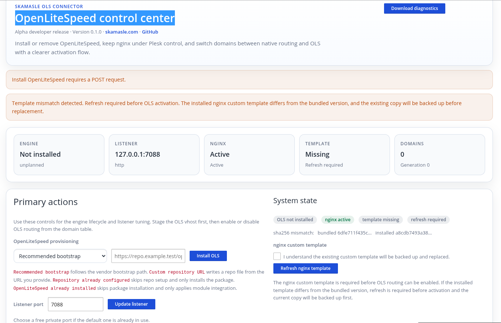
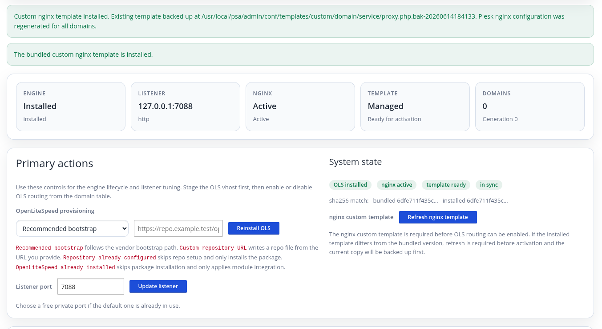
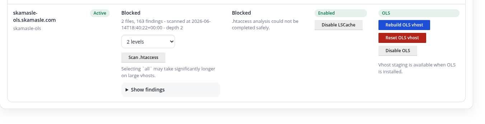
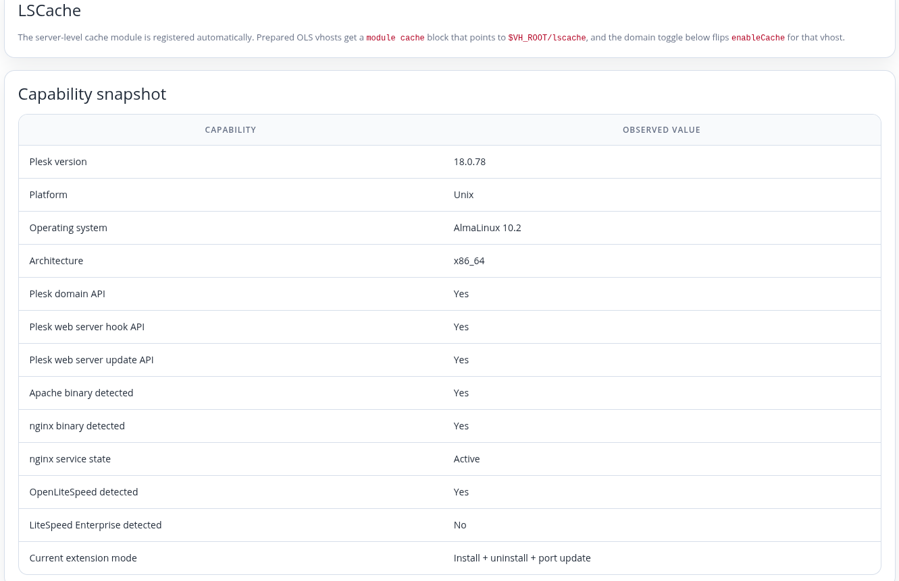

# Skamasle OpenLiteSpeed Module for Plesk

[Versión en español](LEEME.md)

License: GNU General Public License v3.0. See [LICENSE](LICENSE).

Skamasle OLS adds OpenLiteSpeed to Plesk as an optional backend per domain. It
does not replace Apache, remove nginx, or edit Plesk-generated web
configuration directly.

The intended path is:

```text
Plesk nginx :80/:443 -> OpenLiteSpeed on loopback -> LSPHP/LSAPI
```

Domains can stay on the native Plesk stack, or be routed to OLS when their PHP
runtime and `.htaccess` rules are compatible.

## Project Status

This is an experimental module for lab and controlled testing environments. It
is not production-ready yet.

Important limitations:

- Plesk does not officially support OpenLiteSpeed installed manually:
  https://support.plesk.com/hc/en-us/articles/12377585683095-Does-Plesk-support-OpenLiteSpeed-Web-Server-or-LiteSpeed-installed-manually
- OpenLiteSpeed does not support every Apache directive that can appear in
  `.htaccess`: https://docs.openlitespeed.org/config/rewriterules/
- The codebase still needs a complete security and operations review before
  production use.
- Current validation is focused on AlmaLinux 10.2 with a recent Plesk release.
  Other Plesk and OS versions still need testing.

Use this as a development and evaluation project, not as a replacement for a
properly licensed and supported LiteSpeed Enterprise deployment.

## What Exists Today

The repository contains a Plesk extension and an optional standalone agent. The
agent is not packaged in the extension ZIP yet.

The extension can currently:

- discover server capabilities and installed PHP handlers;
- show domain inventory and routing state;
- validate whether a domain can move toward OLS;
- install OpenLiteSpeed without replacing Apache or nginx;
- store vhost configuration in the standard
  `/usr/local/lsws/conf/vhosts/<domain>/vhconf.conf` layout;
- expose per-domain LSAPI process, connection, backlog, timeout, and buffering
  settings;
- keep native Plesk routing as the default fallback;
- store control-plane state for activation and rollback.

Manual changes in OpenLiteSpeed WebAdmin are possible, but the extension remains
authoritative: rebuilding a domain vhost regenerates `vhconf.conf`.

## Build

Build the Plesk extension ZIP from the repository root with:

```bash
bash scripts/build-extension.sh
```

The script stages `extension/` into a fresh archive under `build/` and bumps
the release number automatically. The resulting file follows this pattern:

```text
build/skamasle-ols-plesk-<version>-<release>.zip
```

Install the latest local build with:

```bash
plesk bin extension -i "build/skamasle-ols-plesk-latest.zip"
```

Validate the archive with:

```bash
bash tests/package.sh
```

## Screenshots







## The Idea

A Plesk installation already provides two native modes:

```text
nginx -> Apache -> PHP handler configured in Plesk
nginx -> Plesk PHP-FPM
```

This project preserves both and adds a third:

```text
nginx -> OpenLiteSpeed -> LSPHP/LSAPI + LSCACHE
```

Routing is selected per domain. A single server can simultaneously host:

- domains served by Apache and their Plesk PHP handler;
- nginx-only domains served by PHP-FPM;
- domains routed to OpenLiteSpeed and executed through LSPHP/LSAPI.

The server is not migrated globally. OpenLiteSpeed is used only for domains
whose performance requirements justify LSAPI and whose configuration is
compatible.

Not every domain can run safely on OpenLiteSpeed. Its `.htaccess` support is
not equivalent to Apache's: compatibility primarily covers `mod_rewrite`
rules, while other Apache directives may be unsupported or ignored. Domains
that depend on such directives remain on their native Plesk mode.

## Why Apache Is Not Replaced

Plesk owns Apache: binaries, services, modules, generated configuration,
repairs, updates, certificates, WordPress Toolkit integration, and domain
lifecycle events all expect Apache to remain real.

> Apache remains intact and fully functional.

The extension does not rename Apache binaries, replace services, fake
`Syntax OK`, or edit Plesk-generated Apache configuration. If OpenLiteSpeed
becomes unavailable, affected domains can return to their native Plesk mode.

## Why nginx Remains the Orchestrator

Plesk already uses nginx as the public frontend. Keeping nginx on ports `80`
and `443` preserves TLS, certificates, IP bindings, redirects, panel logging,
WordPress Toolkit behavior, and regeneration through official Plesk tools.

OpenLiteSpeed runs behind nginx on a private loopback listener:

```text
Internet
   |
   v
Plesk-managed nginx :80/:443
   |
   +--> Apache + Plesk PHP
   |
   +--> Plesk PHP-FPM
   |
   `--> OpenLiteSpeed on loopback --> LSPHP/LSAPI
```

The extension changes the upstream only for domains explicitly enabled for OLS.

## Why OLS Is Used Only With LSAPI/LSPHP

OpenLiteSpeed alone does not provide enough benefit if PHP continues to run
through PHP-FPM. Plesk already provides nginx-only with PHP-FPM, so adding
another web server in that path would mostly add complexity.

This project therefore does not implement `OLS + PHP-FPM`. An OLS domain uses:

- its own LSPHP external application;
- an exclusive LSAPI socket;
- the domain system user and group;
- process, memory, and timeout limits;
- per-domain generated PHP configuration.

The preferred runtime is Plesk's own
`/opt/plesk/php/<version>/bin/lsphp`. The extension does not install a parallel
LiteSpeed PHP tree by default, and it verifies LSAPI behavior, PHP parity,
loaded modules, socket execution, and basic health checks before activation.
PHP processes and sockets are never shared globally across subscriptions.

The `extProcessor lsphp` and `scriptHandler add lsapi:lsphp php` names are
rendered inside each vhost config. In practice that makes them vhost-local, so
reusing the same names across domains is not a multiuser collision by itself.
The real isolation boundary is the vhost config, the socket path, and the
domain system user and group. Domain-specific names are optional for operator
clarity, but they are not required for safety.

nginx forwards `X-Real-IP` and `X-Forwarded-For` to the OLS backend, so
applications can recover the client IP from request headers. OLS access logging
is intentionally disabled by default. nginx/Plesk remains responsible for access
logs and writes OLS-routed traffic to the Plesk proxy logs. This avoids changing
ownership or permissions on Apache/Plesk-managed files such as `access_ssl_log`,
which is part of the project's policy of not breaking Plesk-managed state.

Per-vhost error logs are explicit and live under the standard Plesk domain log
directory using an OLS-specific file name. Access requests should be reviewed in
the nginx/Plesk proxy logs, `proxy_access_ssl_log` or `proxy_access_log`
depending on the public vhost. For example:

```text
errorlog /var/www/vhosts/system/DOMINIO/logs/ols_error_log {
  useServer               0
  logLevel                ERROR
  rollingSize             100M
}

```

That error log path is rendered in each managed OLS vhost config.

The private OLS listener also needs TLS to work with `secure 1`. The current
strategy is to generate a global self-signed certificate after OLS is
installed, store it under `/usr/local/lsws/conf/ssl/`, and reuse it for the
loopback listener across all domains. The intended filenames are
`skamasle-ols.key` and `skamasle-ols.crt`, with a long-lived validity window
of about 10 years. This is a temporary backend-only trust anchor for
nginx-to-OLS communication until the integration can reuse a better SSL source
or a different trust model.

## Per-Domain Modes

The extension exposes only two routing states:

### `native`

Plesk uses the domain's normal configuration:

- proxy mode: nginx -> Apache -> Plesk PHP handler;
- nginx-only: nginx -> Plesk PHP-FPM.

The extension does not change these preferences. Plesk remains their source of
truth.

### `ols`

nginx routes the domain to OpenLiteSpeed, and PHP runs through LSPHP/LSAPI.

This mode is applied only when:

1. the Plesk version and template are recognized;
2. the OLS configuration is valid;
3. sufficient PHP parity has been verified;
4. `.htaccess` contains no blocking incompatibilities;
5. `openlitespeed -t` and `nginx -t` pass;
6. static and PHP health checks pass;
7. returning to `native` is prepared.

## Updates and `plesk repair web`

The extension does not directly edit files under `/var/www/vhosts/system`,
Plesk templates, or generated nginx configuration. It uses documented APIs and
hooks, primarily:

- `pm_Hook_WebServer::processTemplate()`;
- `pm_WebServer::updateDomainConfiguration()`;
- Plesk events as reconciliation signals;
- `pm_ApiCli::callSbin()` for controlled privileged operations.

Routing adapters are validated against fixtures from specific Plesk versions.
If an update changes a template and its adapter no longer recognizes it, the
adapter returns the original content and preserves or restores `native` mode.

The safety principle is:

> An unknown version must not produce a partially modified configuration. It
> must leave the domain on the native Plesk stack.

The project does not claim blind compatibility with every future release. It
detects uncertified versions and falls back to configuration managed by Plesk.

## `.htaccess`

OpenLiteSpeed can load `mod_rewrite` rules from `.htaccess`, including files in
subdirectories, but it does not implement Apache's complete per-directory
directive system:

- `.htaccess` compatibility primarily covers `mod_rewrite`;
- directives such as `Require`, `Allow`, `Deny`, `AuthType`, `Header`,
  `Options`, `php_value`, and `php_flag` require specific analysis and may
  prevent OLS activation;
- OLS may ignore unsupported directives, potentially removing security
  controls or silently changing behavior;
- rewrite changes require a graceful OLS restart.

This limitation is another reason nginx remains the frontend. The extension can
translate compatible access controls, authentication, headers, and HTTP
behavior into generated and validated nginx configuration before routing a
domain to OLS. Similarly, `php_value` and `php_flag` settings must be moved to
the domain-specific LSPHP configuration.

nginx does not interpret `.htaccess`, and not every Apache directive can be
translated automatically. The extension reports rules with no safe equivalent
and requires explicit administrator acknowledgement before OLS activation.

Before activation, the extension analyzes `.htaccess` files in the document
root and its subdirectories. Unknown or incompatible directives produce a
review warning. Activation is hard-blocked only when the scan cannot complete
reliably, for example because files are unreadable or safety limits are
exceeded.

`skamasle-ols-agent` includes a `.htaccess` monitoring system limited to domains
with applied OLS routing. When it detects creation, modification, replacement,
or deletion of one of these files, it debounces the events, analyzes
compatibility again, and validates the resulting configuration.

If the change is compatible, the agent reloads OLS with a graceful restart so
the new rules take effect without interrupting active connections. If the
change introduces an unsafe or untranslatable directive, the agent does not
silently apply a partial configuration: it records the incompatibility and
keeps or returns the domain to its native Plesk mode.

## Components

```text
Skamasle OLS adapter for Plesk
  - administration interface
  - domain inventory
  - native/ols desired state
  - official Plesk hooks
  - long-running installation and update tasks

skamasle-olsctl
  - privileged interface with a closed command set
  - package installation and validation
  - reconciliation requests

skamasle-ols-agent
  - state reconciliation
  - atomic OLS configuration generation
  - per-domain LSPHP/LSAPI configuration
  - validation and health checks
  - .htaccess monitoring
  - rollback to the last valid generation

OpenLiteSpeed
  - loopback-only backend listener
  - one virtual host per domain
  - isolated LSPHP/LSAPI per domain
```

## Installation and Activation

Installing the extension does not automatically change the web stack or enable
OLS for any domain.

The onboarding flow is:

1. check the operating system, Plesk, nginx binary and service state, Apache,
   and available capabilities;
2. install OpenLiteSpeed and validate the Plesk-provided `lsphp` binaries;
3. configure the private OLS listener;
4. inventory domains and their PHP configuration;
5. analyze compatibility and prepare each virtual host;
6. validate OLS, LSAPI, and nginx;
7. explicitly activate the selected domains.

Every domain retains its native mode as a recovery path.

## Operation and Recovery

For each domain, the extension maintains:

- requested and applied routing;
- observed native mode;
- PHP version and configuration;
- LSAPI runtime and socket;
- `.htaccess` compatibility;
- validation results;
- the last valid OLS configuration.

If OLS, LSAPI, PHP parity, a health check, or adapter compatibility fails, the
domain returns to `native` through a Plesk-managed regeneration.

Uninstallation first restores every domain to its native mode, validates
Apache, nginx, and PHP as appropriate, and removes only resources created by
the extension.

## Design Principles: Do Not Break Plesk

The central idea is to integrate OpenLiteSpeed while minimizing interference
with components and processes managed by Plesk:

- keep Apache installed, running, and free of wrappers;
- keep nginx under Plesk control and on the public ports;
- use OLS only as a private backend;
- run PHP on OLS through LSPHP/LSAPI, not PHP-FPM;
- isolate the PHP runtime for each domain;
- avoid directly editing files generated by Plesk;
- generate and apply OLS configuration atomically;
- never send traffic to OLS before validation succeeds;
- keep domains in `native` when the Plesk version is unrecognized;
- allow `plesk repair web` to operate against the real Plesk stack.

These principles reduce risk, but do not replace compatibility testing for
every supported Plesk, OLS, nginx, Apache, PHP, and LSPHP version.
